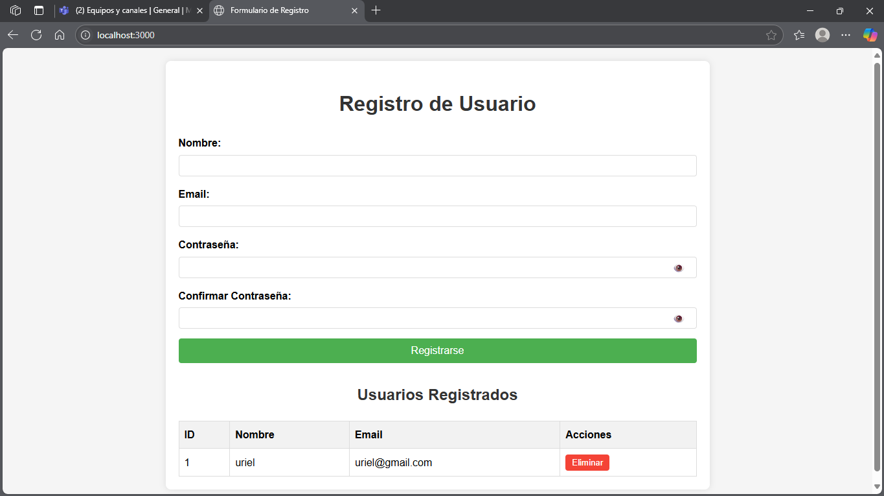
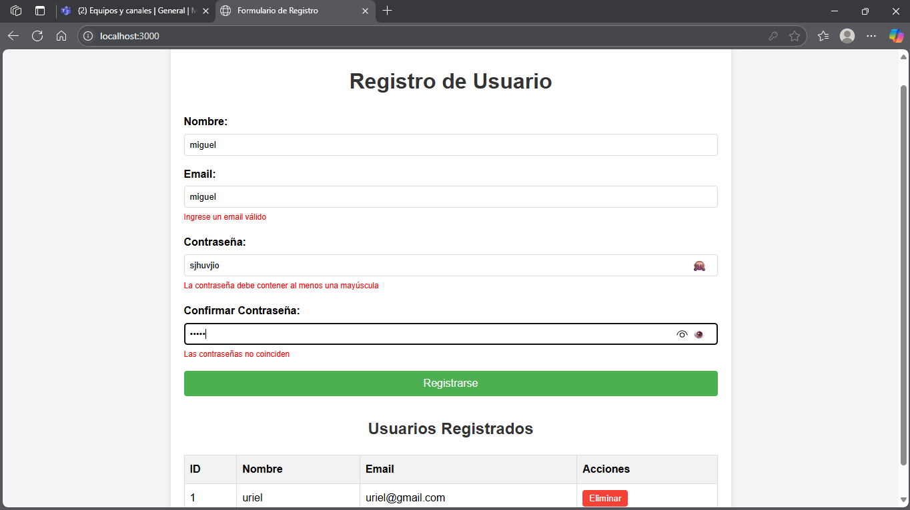
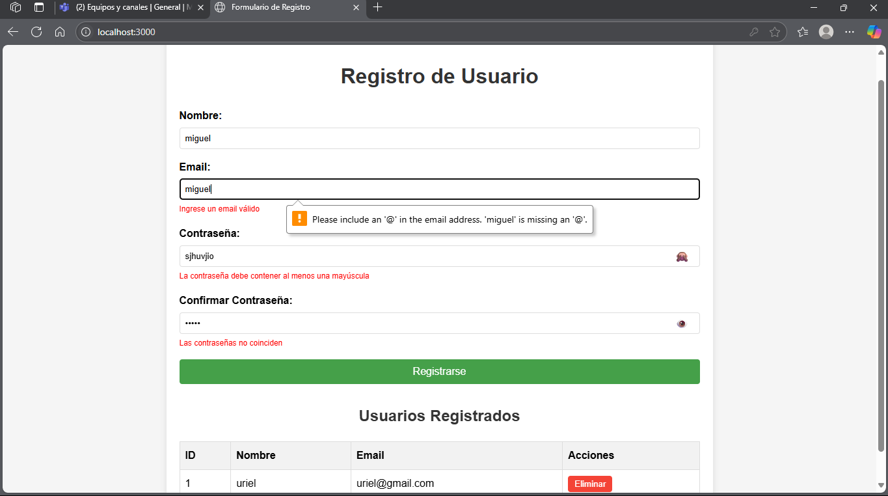

Instrucciones para ejecución local
Requisitos previos
Node.js (v14 o superior)

npm (v6 o superior)

Pasos para ejecutar localmente
Clonar el repositorio:
git clone https://github.com/tu-usuario/proyecto-formulario.git
cd proyecto-formulario

Instalar Dependencias
npm install

Iniciar Aplicacion
npm start

Abrir navegador
http://localhost:3000

La aplicación está desplegada en Render.com y puede accederse en: 
https://proyecto-final-web-2.onrender.com

Decisiones técnicas
Frontend
Validación en tiempo real: Implementada con JavaScript puro para mejor performance y menor tamaño de bundle.

Vanilla JavaScript: Decidí no usar frameworks como React o Vue para mantener la simplicidad del proyecto.

Feedback visual claro: Mensajes de error específicos para cada campo con estilos diferenciados.

Backend
Express.js: Elegido por su simplicidad y amplia adopción en la comunidad Node.js.

SQLite: Base de datos ligera perfecta para este tipo de aplicaciones pequeñas.

REST API: Diseño de API RESTful con métodos POST, GET y DELETE para las operaciones CRUD.

Base de datos
SQLite: No requiere servidor separado, ideal para proyectos pequeños y pruebas.

Estructura simple: Tabla única usuarios con los campos necesarios.

Validación en backend: Además de la validación en frontend, el backend también valida los datos.

Despliegue
Render.com: Plataforma simple y con buen plan gratuito para proyectos pequeños.

Configuración mínima: El proyecto está listo para desplegarse con la configuración por defecto de Render.

